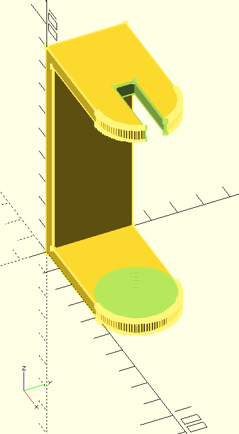

# toothbrush holder customizable

This is my first attempt to use OpenScad to build a toothbrush holder that meets my requirements.
You can currently use OpenScad to adjust the values ​​and adapt the holder to different electric toothbrushes.

It is not quite finished yet and I have not yet done a test print, but I assume that there should be no problems with my resin printer.

## Current ToDos:

- [ ] Customizing the holder with a name abbreviation

- [ ] Optional bowl instead of the base of the holder for easier cleaning, has the disadvantage that the holder then has to be glued on or has to be made higher to fit the bowl below the brush

- [ ] Optionally make the print customizable so that several holders can be printed hanging next to each
    other

